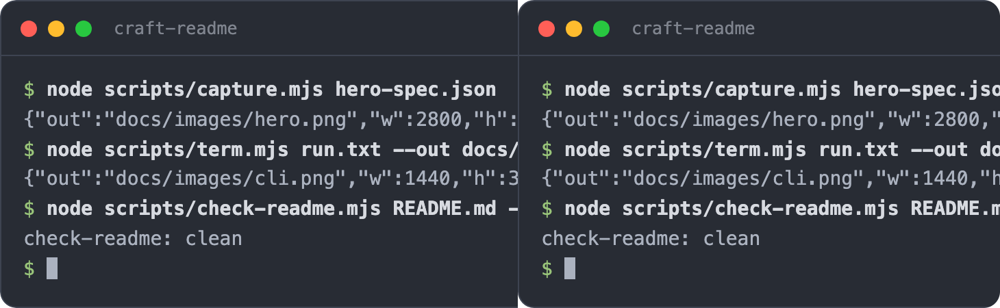
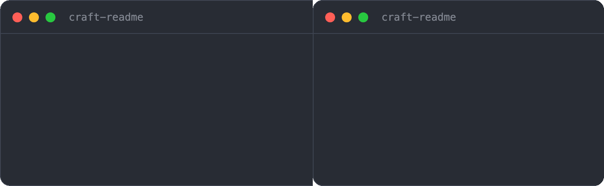
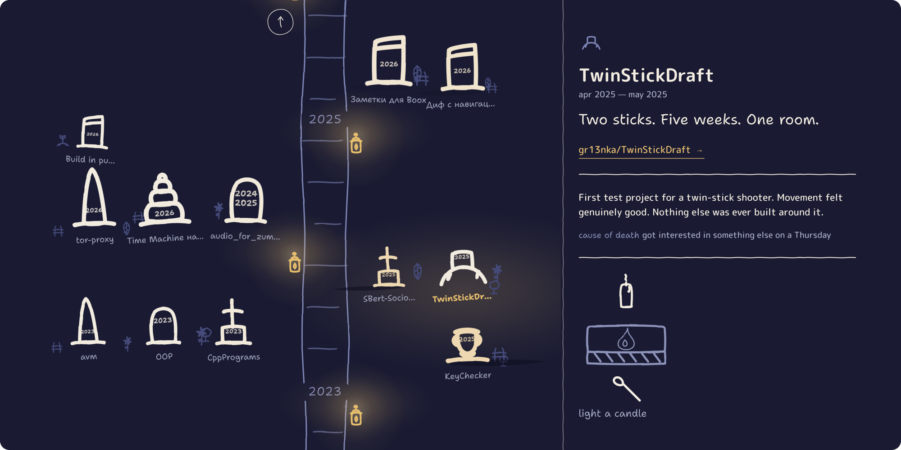

<!-- craft-readme: voice=deadpan -->
<div align="center">

# craft-readme

***Nobody reads the wall of text. Show them the thing.***

craft-readme is a Claude Code skill that rebuilds a README as a landing page and takes the screenshots itself.

[](LICENSE)
[](https://docs.claude.com/en/docs/claude-code)




</div>

Most READMEs are the same wall of text. Setup steps, an options table nobody opens, not one
picture of the thing running.

craft-readme cuts it down to a landing page: a screenshot, a short GIF, a quick start. The
reference goes in a guide behind a link.

## What it does



The options and schemas move to `docs/GUIDE.md`. A hero shot and a GIF go in, captured over
headless Chromium with the corners cut out so they sit on either GitHub theme.
[The full pipeline →](docs/GUIDE.md#the-capture-scripts)

## Use it with your agent

In Claude Code, from the project you want a README for:

```
/craft-readme
```

It reads the repo, picks the shots, takes them, writes the README and the guide, checks the
links and images, and stops. You commit.

## Install

Clone it where Claude Code keeps skills:

```bash
git clone https://github.com/gr13nka/craft-readme ~/.claude/skills/craft-readme
```

Node 22+ and any Chromium browser. No `npm install`, there's nothing to install.

## Run the scripts directly

The tools work on their own, without the skill:

```bash
node scripts/capture.mjs spec.json                        # web page → rounded PNG, or GIF
node scripts/term.mjs run.txt --out cli.png --title app   # a transcript → terminal card
node scripts/readme-shot.mjs README.md --out readme.png   # a README → how GitHub shows it
node scripts/check-readme.mjs README.md --docs docs       # dead links, placeholders, budgets
node scripts/check-voice.mjs README.md                    # "seamlessly", emoji, the wink; lints to the README's register
node scripts/check-discovery.mjs README.md               # description, topics, alt text, the social card
```

## Example output

A README this made, rendered how GitHub shows it. Centred header, real badges, a hero and a
GIF, the rest moved to a linked guide:



## FAQ

**Playwright? ffmpeg?** Neither. Node 22 has a WebSocket, that's the dependency list. GIFs
are encoded in plain Node.

**Can it render my README before I push?** Yes. It reads the local file. GitHub doesn't
need to see it first.

**My project has no screenshots.** It makes them. Web pages get driven in a headless
browser, CLIs get a terminal card, and anything else, you hand it one image and it rounds
the corners.

**Will it eat my docs?** No. They move to `docs/GUIDE.md` word for word, and a check proves
nothing dropped out.

**Will it read like a bot wrote it?** There's a check for that. Emoji, "seamlessly", "feel
free to", "pro tip", the joke in parentheses all fail it. What passes is dry.

**My project isn't a joke.** Then the README won't be one. Three registers: plain, deadpan,
quiet. Say which, or it picks from the project. The pick goes on line one.

## Docs

The rest is in **[docs/GUIDE.md](docs/GUIDE.md)**:
[install](docs/GUIDE.md#install) · [the capture scripts](docs/GUIDE.md#the-capture-scripts) · [the checks](docs/GUIDE.md#the-checks) · [the voice](docs/GUIDE.md#the-voice) · [being found](docs/GUIDE.md#being-found).

## License

MIT. Fork it, rename it, ship it.
